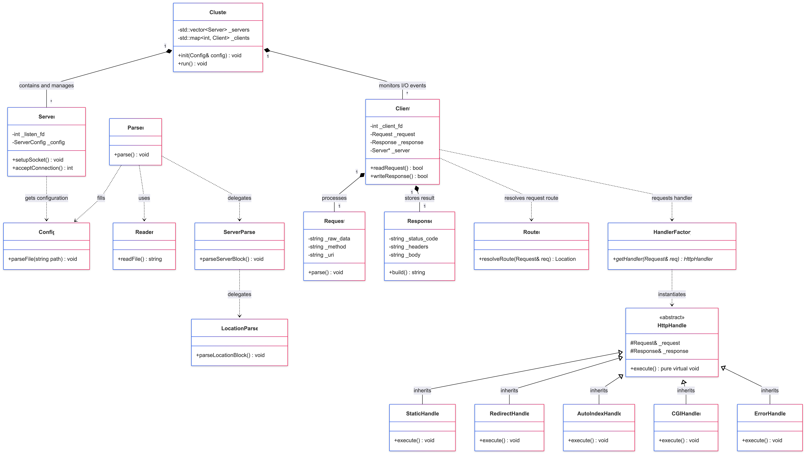
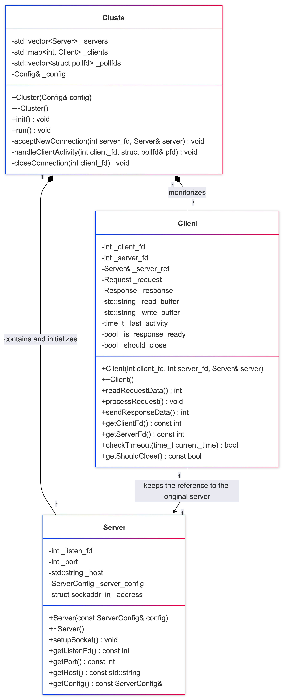
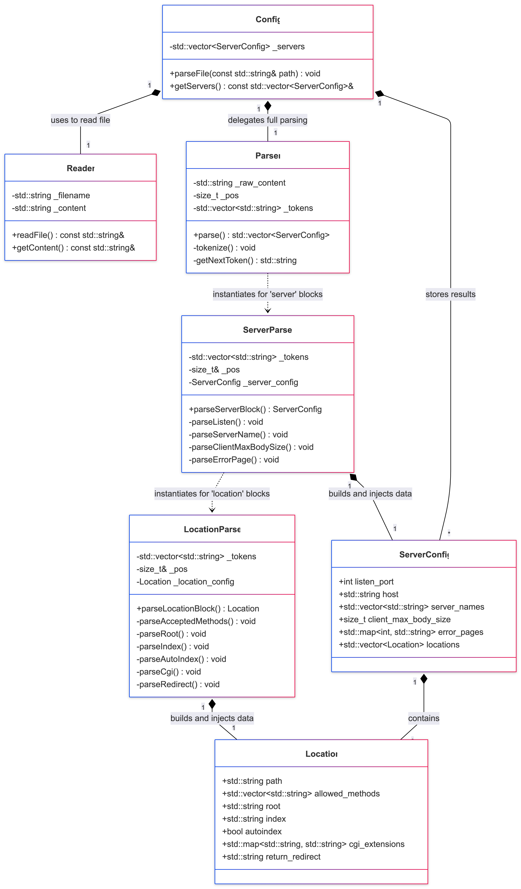
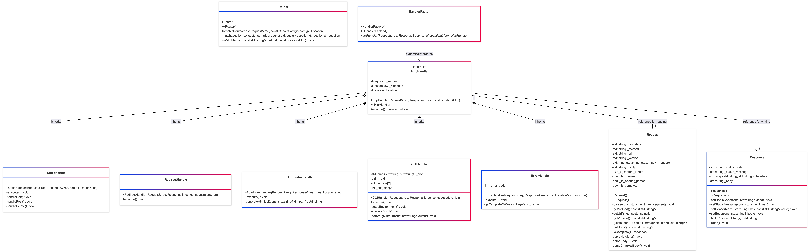

*This project has been created as part of the 42 curriculum by cochatel, datienza and avelandr.*

# Webserv


## Description
Webserv is a non-blocking HTTP/1.1 server written in C++98. The main goal of the project is to understand the HTTP protocol in depth, network socket management, and Input/Output multiplexing using system calls such as `select`, `poll`, `epoll`, or `kqueue`, preventing any blocking behavior during read or write operations.

## Instructions
To compile the whole project use the rule:
``` bash
make
```

It creates the executable `webserv` you can run with a configuration file.
``` bash
./webserv [config file]
```

## Resources
[HTTP and sockets](https://medium.com/from-the-scratch/http-server-what-do-you-need-to-know-to-build-a-simple-http-server-from-scratch-d1ef8945e4fa)
[Webserver article](https://m4nnb3ll.medium.com/webserv-building-a-non-blocking-web-server-in-c-98-a-42-project-04c7365e4ec7i)
AI Usage: AI tools (Gemini) were utilized during this project to help clarify complex networking concepts, assist in designing the configuration parser logic, and suggest testing approaches. Helped creating testing files (a.k.a. HTML test pages and configuration files to test the parsing) we used to validate the server's behavior and catch edge cases during its initialdevelopment, but replaced in the end of the project.

## Architecture

In global terms, the project is organized as follows:



### Core (Network and Event Management)
* **Cluster (`Cluster.cpp` / `Cluster.hpp`):** Acts as the main orchestrator of the server. It initializes all virtual servers defined in the configuration, configures the file descriptor sets for multiplexing, and maintains the main event loop.
* **Server (`Server.cpp` / `Server.hpp`):** Abstracts passive listening sockets. It binds a specific IP address and port (`bind`) and sets them to listening mode (`listen`), waiting for incoming connections.
* **Client (`Client.cpp` / `Client.hpp`):** Represents and manages the active connection state with a specific client. It stores read and write buffers, the data socket returned by `accept`, and controls connection timeouts.



### Parse (Configuration)
* **Configuration (`Config.cpp`, `Parser.cpp`, `ServerParser.cpp`, `LocationParser.cpp`, `Reader.cpp`):** Module responsible for reading and validating a structured configuration file (with a syntax similar to Nginx).



### HTTP (Processing and Routing)
* **Request (`Request.cpp` / `Request.hpp`):** Parser responsible for sequentially processing the raw byte stream received from the client. It splits the request line (Method, URI, Version), HTTP headers, and the request body (supporting encodings such as `chunked`) in a synchronous and structured manner.
* **Router (`Router.cpp` / `Router.hpp`):** Analyzes the request URI against the matching rules of the `location` blocks defined in the configuration to determine the ideal destination for the resource.
* **Handlers Logic (`HttpHandler.cpp`, `HandlerFactory.cpp`, `StaticHandler.cpp`, `RedirectHandler.cpp`, `AutoIndexHandler.cpp`, `ErrorHandler.cpp`):** Polymorphism-based implementation to process requests according to their type:
  * **StaticHandler:** Manages requests for static files (GET, POST, DELETE) in the file system.
  * **RedirectHandler:** Applies HTTP redirections configured via 3xx status codes.
  * **AutoIndexHandler:** Dynamically generates an HTML listing with the contents of a directory if automatic indexing is enabled.
  * **ErrorHandler:** Builds and integrates responses associated with HTTP error codes.
* **CGIHandler (`CGIHandler.cpp` / `CGIHandler.hpp`):** Module responsible for the Common Gateway Interface. It prepares the necessary environment variables, forks the process (`fork`), redirects standard input/output using pipes (`pipe`), and executes external scripts (such as PHP or Python) asynchronously.
* **Response (`Response.cpp` / `Response.hpp`):** Responsible for packaging and formatting the final response (status line, HTTP headers like `Content-Type` or `Content-Length`, and body) into a character string ready to be sent to the client.



#### Utility Tools
* **Utils (`Utils.cpp`, `Error.cpp`):** Contains helper functions for string manipulation, data conversion, and error management.
* **print_msg:** Centralized system for server log registration. It allows classifying and emitting log traces by clearly distinguishing importance levels and message types.

### Structure
```text
├── Makefile
├── srcs
│   ├── core
│   │   ├── Client.cpp
│   │   ├── Cluster.cpp
│   │   └── Server.cpp
│   ├── cgi
│   │   └── CGIHandler.cpp
│   ├── utils
│   │   ├── Error.cpp
│   │   └── Utils.cpp
│   ├── http
│   │   ├── AutoIndexHandler.cpp
│   │   ├── CGIHandler.cpp
│   │   ├── ErrorHandler.cpp
│   │   ├── HandlerFactory.cpp
│   │   ├── HttpHandler.cpp
│   │   ├── RedirectHandler.cpp
│   │   ├── Request.cpp
│   │   ├── Response.cpp
│   │   ├── Router.cpp
│   │   └── StaticHandler.cpp
│   ├── parse
│   │   ├── Config.cpp
│   │   ├── LocationParser.cpp
│   │   ├── Parser.cpp
│   │   ├── Reader.cpp
│   │   └── ServerParser.cpp
│   └── Webserv.cpp
├── inc
│   ├── Error.hpp
│   ├── Webserv.hpp
│   ├── core
│   │   ├── Client.hpp
│   │   ├── Cluster.hpp
│   │   └── Server.hpp
│   ├── http
│   │   ├── AutoIndexHandler.hpp
│   │   ├── CGIHandler.hpp
│   │   ├── ErrorHandler.hpp
│   │   ├── HandlerFactory.hpp
│   │   ├── HttpHandler.hpp
│   │   ├── RedirectHandler.hpp
│   │   ├── Request.hpp
│   │   ├── Response.hpp
│   │   ├── Router.hpp
│   │   └── StaticHandler.hpp
│   └── parse
│       ├── Config.hpp
│       ├── LocationParser.hpp
│       ├── Parser.hpp
│       ├── Reader.hpp
│       └── ServerParser.hpp
└── www
    └── index.html
```
